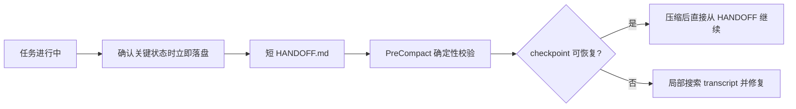

# Codex Memory Guard

一个面向 Codex 长任务的轻量级记忆与任务边界护栏。它不承诺“永不遗忘”，而是把真正会造成返工的关键状态，从易损的长会话中提取出来，保存为短小、可审计、可恢复的项目文件。

> 当前版本：v0.2.1 · Windows PowerShell · MIT License

## 为什么需要它

长会话会不断占用上下文，并可能触发自动压缩。压缩摘要适合维持对话连续性，但它是有损的：模型认为重要的信息，不一定等于用户认为必须保留的信息。

Codex Memory Guard 将两类问题分开处理：

- **任务边界**：当前任务未完成时，识别不相关的新方向，轻量提醒是否新建 Codex 任务。
- **持久状态**：关键决策、约束、验收标准、阻塞和恢复断点在确认时立即写入项目文件，而不是等到压缩发生。

## 工作原理



`HANDOFF.md` 不是等压缩后才生成：它在任务进行中持续维护，并应在压缩或交接前保持最新。`PreCompact` Hook 只验证结构、长度和证据元数据，不做语义总结；压缩后仅在校验失败、状态冲突或关键信息缺失时，才定向搜索原始 transcript 并修复。

## 四层记忆

| 文件 | 用途 | 默认加载 |
|---|---|---|
| `HANDOFF.md` | 一个当前目标、当前状态、阻塞、最多三个里程碑、一个下一步和关键文件 | 是 |
| `DECISIONS.md` | 已确认的重要决策、原因、来源与失效条件 | 按需 |
| `LESSONS.md` | 已验证且可复用的实践 | 按需 |
| `memory/YYYY-MM-DD.md` | 当天经历和未确认的候选记忆 | 按需 |

`HANDOFF.md` 建议控制在 500–1000 个字符，硬上限 1500 个字符。原始 transcript 只作为最后的证据入口，不默认塞回上下文。

## 任务边界状态机

状态机包含：

```text
ACTIVE -> BOUNDARY_CANDIDATE -> CONTINUE_CURRENT
                            \-> SWITCH_RECOMMENDED
ACTIVE -> COMPLETED
```

判断顺序是“先看是否推进当前目标，再估计持续时间”。相关的解释、质疑、纠错、同一交付物调整和结果检查不会触发提醒；明显无关且可能开启独立方向的话题，即使很短，也会提醒一次。用户选择留在当前任务后，同一边界不重复提醒。

完整转换与验收案例见 [task-boundary-state-machine.md](references/task-boundary-state-machine.md)。

## 安装

要求：Windows、PowerShell，以及支持 lifecycle Hooks 的 Codex 环境。

```powershell
git clone https://github.com/wl1650918245/codex-memory-guard.git
Set-Location .\codex-memory-guard
powershell -NoProfile -ExecutionPolicy Bypass -File .\scripts\install.ps1 -ProjectRoot C:\path\to\your-project
```

安装器会：

1. 安装 `PreCompact` 与 `SessionStart(compact)` Hook；
2. 向全局 `AGENTS.md` 合并带标记的受管理规则，不覆盖其他规则；
3. 可选地为指定项目初始化四层记忆文件；
4. 修改现有配置前创建备份。

安装后请在 Codex 中打开 `/hooks`，检查并信任两个处理器。信任前不要假设 Hook 已生效。

只初始化单个项目：

```powershell
powershell -NoProfile -ExecutionPolicy Bypass -File .\scripts\initialize-memory-system.ps1 -Root C:\path\to\your-project -SingleProject
```

初始化某个目录下的所有一级子项目：

```powershell
powershell -NoProfile -ExecutionPolicy Bypass -File .\scripts\initialize-memory-system.ps1 -Root C:\path\to\projects
```

## 验证

运行隔离回归：

```powershell
$scratch = Join-Path $env:TEMP ("codex-memory-guard-test-" + [guid]::NewGuid().ToString("N"))
powershell -NoProfile -ExecutionPolicy Bypass -File .\scripts\test.ps1 -ScratchRoot $scratch
```

检查一个现有 checkpoint：

```powershell
powershell -NoProfile -ExecutionPolicy Bypass -File .\scripts\validate-handoff.ps1 -Path C:\path\to\project\HANDOFF.md
```

## 卸载

```powershell
powershell -NoProfile -ExecutionPolicy Bypass -File .\scripts\uninstall.ps1
```

卸载只移除本 Skill 的 Hook 和全局 `AGENTS.md` 受管理区块；不会删除项目记忆文件，也不会删除其他 Hook 或用户规则。

## 它不是什么

- 不是 Codex 原生 memories 的替代实现；
- 不是向量数据库或完整知识库；
- 不保证无损保存全部聊天内容；
- Hook 不会在压缩瞬间自动理解并总结整段会话；
- 不会未经确认自动创建、切换或关闭 Codex 任务；
- 不在记忆文件中保存密钥、令牌或其他敏感信息。

它解决的是更窄但更可控的问题：让已经确认的重要状态可见、可核验、可恢复。

## 仓库结构

```text
codex-memory-guard/
├── SKILL.md                 # Codex 执行入口
├── agents/openai.yaml       # Skill UI 元数据
├── assets/templates/        # 项目记忆与全局规则模板
├── references/              # 记忆契约和状态机规范
└── scripts/                 # 安装、初始化、Hook、校验和测试
```

## License

[MIT](LICENSE)
